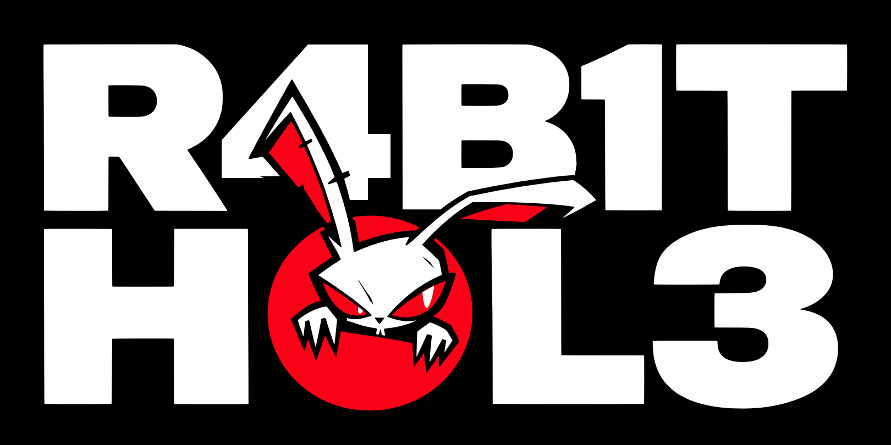

# R4B1T H0L3

<p align="center">
  <a href="https://r4b1t.badbananaresearch.com">
    
  </a>
</p>

**Chance-driven discovery for security, OSINT, research, development, and unusual parts of the web.**

[**Open the instrument →**](https://r4b1t.badbananaresearch.com) · [GitHub Pages entry](https://gnomeman4201.github.io/r4b1t-h0le/)

ROLL discloses one destination from the eligible corpus. You decide whether to open it, inspect it, keep a local card, or roll again. There is no query to write and no ranked results page to work through.

No recommendation profile. No engagement feed. History does not steer the next roll.

## Use the instrument

1. **ROLL** to select and disclose a resource.
2. **OPEN DESTINATION** to visit it, **KEEP CARD** to download a local PNG, or **INSPECT** to examine its metadata on mobile.
3. **ROLL AGAIN** for another selection. Keeping or refusing a resource does not train a profile.

On a phone, each roll replaces the landing screen with its result. Open **MENU** for filters, branching, history, and trail tools.

**Filters change eligibility, not ranking.** Choose a terrain explicitly before rolling. The sampler does not infer filters from your activity.

Terrains are the active release's own resource types. Each control shows its eligible count before you roll. A terrain with no eligible routes cannot be armed, and a single-route terrain says so.

| Terrain | Label | Routes |
| --- | --- | --- |
| `advisory` | ADVISORY | 43 |
| `article` | ARTICLE | 11 |
| `dataset` | DATASET | 22 |
| `documentation` | DOCUMENTATION | 1408 |
| `lab` | LAB | 282 |
| `paper` | PAPER | 895 |
| `reference` | REFERENCE | 871 |
| `repository` | REPOSITORY | 470 |
| `research` | RESEARCH | 1584 |
| `security_tool` | SECURITY TOOL | 206 |
| `threat_feed` | THREAT FEED | 6 |
| `training_resource` | TRAINING RESOURCE | 12 |
| `writeup` | WRITEUP | 1049 |

Membership comes from a [terrain index](./corpus/terrains/diverse-candidate-v0.2/terrain-index-v1.json) compiled from the release's `urls.txt` and `resources.json`. The index is authoritative only because the [eligibility profile registry](./corpus/runtime/eligibility-profiles-v1.json) names its digest for the active release. A digest recorded in a trail shows which map was used. It does not make that map authoritative. See the [terrain authority contract](./TERRAIN_AUTHORITY_CONTRACT.md) and [ADR 0006](./docs/adr/0006-release-bound-terrain-authority.md). The `SITE HINT` badge on a result is a display-only hostname hint, not a terrain.

**BRANCH is a separate navigation action.** DEEPER, SIDEWAYS, OPPOSITE, and WEIRD offer directions from the current resource. Branch construction uses available metadata and keyword matching; it is not the ROLL sampler. These labels are navigational hints, not factual or security classifications.

**BLIND DESCENT delays disclosure.** An explicit descent creates one concealed route commitment. Reveal checks the disclosed route and nonce against that commitment. Choosing the mode alone does not commit a route.

## Inside a roll

The active population is the promoted `diverse-candidate-v0.2` release: **6,859 resources across 318 hosts**, with **13 resource types**. The [promotion record](./corpus/runtime/active-v1.json) grants runtime authority to its digest-bound URL bytes; the [release manifest](./corpus/releases/diverse-candidate-v0.2/manifest.json) records the release evidence. A digest mismatch rejects the load rather than silently falling back to the legacy pool.

| Layer | Authority |
| --- | --- |
| Corpus | Digest-verified URL bytes define the selection population. |
| Filters | Explicit terrain (registry-anchored terrain index) and protocol constraints define eligibility. |
| ROLL | The sampler commits one selection transaction. |
| Presentation + trail | Disclose and record that transaction; neither can replace its destination. |

History, wear, popularity, and display metadata have no authority over ROLL. The documented immediate-repeat guard is a mechanical exception; accumulated domain history is not a sampler input. Animation presents a committed result and cannot choose or replace it.

The [product contract](./CONTRACT.md), [anti-ranking ADR](./docs/adr/0001-anti-ranking-boundary.md), and [selection transaction ADR](./docs/adr/0004-immutable-selection-transactions.md) describe these boundaries. An ADR's proposed guarantee is not, by itself, evidence that an exported format implements it.

## Preserve the route. Inspect the evidence.

Route and session state are device-local. Trails preserve recorded routes in their actual order; replay uses those recorded URLs rather than substituting a newer corpus. Session History records disclosed discovery selections and is distinct from proof that a destination was opened.

| Check | Evidence and limit |
| --- | --- |
| Trail identifier | Establishes canonical manifest integrity. Does not establish authorship, truthful sampler execution, or destination visits. |
| Parent + child | Establishes declared lineage and the matching inherited prefix. A parent identifier alone is insufficient. |
| Blind reveal | Establishes that route and nonce match the recorded commitment and context. Does not prove wall-clock ordering or absence of a privately truncated tail. |
| Concealed step | Establishes snapshot integrity and structural placement. Does not verify a reveal or resolve the cryptographic chain. |

Exported files can be checked without an account:

```bash
npm run trail:verify -- trail.json
npm run trail:verify -- child.json parent.json
```

The ordinary trail verifier checks `r4b1t-trail/v0.1` integrity and declared lineage. Blind Descent uses `r4b1t-trail/v0.2` and its own verification rules. Recording immutable selection transactions does not make v0.1 an independently verified sampler-provenance format.

Trail Cards, Topology, Compare Trails, Proof Sessions, and Verify + Replay expose additional views and checks. Their outputs carry only the claims supported by their format and verifier; a detached image does not acquire proof authority.

Read the [trail ADR](./docs/adr/0002-content-addressed-trails.md) and [Blind Descent ADR](./docs/adr/0003-blind-descent-commit-reveal.md) for serialization, concealment, migration, and verification limits. Concealment protects public exports; it does not hide browser memory from the person controlling the device.

## Local state and external requests

Exploration and trail verification require no r4b1t account. No r4b1t analytics, profile, or engagement tracking is used. Device-local state does not mean the application makes no network requests.

Automatic metadata, favicon, preview-image, and optional Wikipedia enrichment requests pass through the project-controlled Worker, which enforces a browser Origin allowlist. Origin checking is a browser/CORS abuse-control boundary, not authentication. The [Worker boundary](./docs/WORKER_TRUST_BOUNDARY.md) separates versioned source, dated deployment evidence, and platform-level logging concerns.

Opening a destination leaves that boundary. External sites control their own content and request handling. Corpus inclusion, a valid digest, a resource label, or a successful liveness check does not certify safety, truth, or continued availability.

The [legacy corpus baseline](./docs/readme/legacy-corpus-evidence.md) is historical evidence, not the active selection population.

## Run and verify

The production client is static HTML, CSS, and JavaScript, with no production build step. Node.js supports tests and verification tooling.

```bash
git clone https://github.com/GnomeMan4201/r4b1t-h0le.git
cd r4b1t-h0le
python3 -m http.server 8080
```

Open `http://127.0.0.1:8080/`. Some metadata and preview behavior depends on deployed services.

```bash
npm ci
npx playwright install chromium
npm test

# Repository claims; then deployed surfaces
npm run claims:verify
npm run claims:verify:live
npm run shadow:verify
```

Browser coverage includes desktop and mobile behavior. A green run establishes the tested behavior for that revision, not the trustworthiness of external destinations. Python corpus checks and pool-maintenance instructions live in [CONTRIBUTING.md](./CONTRIBUTING.md).

## Sharpen the instrument

Useful contributions include concrete resources, broken-link reports, reproducible bugs, accessibility fixes, and corrections to evidence claims. Changes must preserve history-blind selection and the distinction between eligibility, presentation, and verification.

[Contribute](./CONTRIBUTING.md) · [Report a bug or submit a URL](https://github.com/GnomeMan4201/r4b1t-h0le/issues) · [Report a vulnerability privately](./SECURITY.md) · [Releases](https://github.com/GnomeMan4201/r4b1t-h0le/releases) · [MIT license](./LICENSE)

**badBANANA Research Collective**
